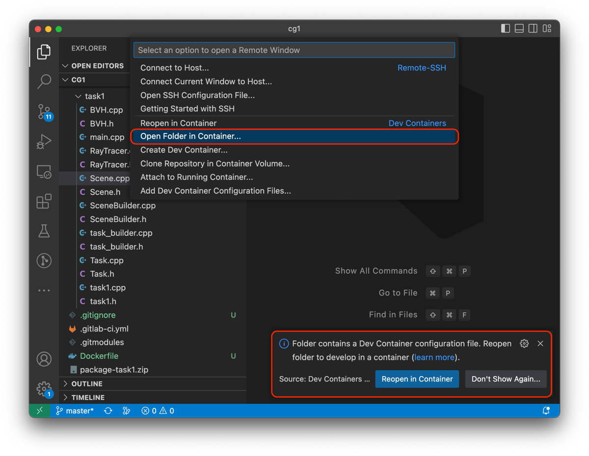
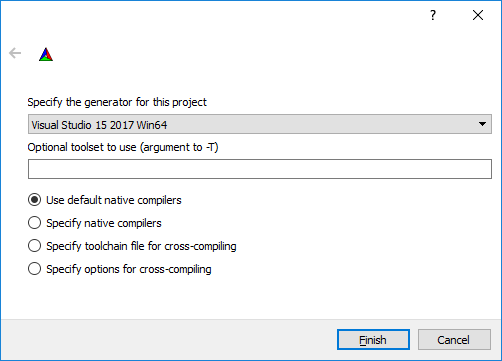

Here lies the framework provided for task1 of the 2024 courses ["Computergraphics"](https://online.tugraz.at/tug_online/ee/ui/ca2/app/desktop/#/slc.tm.cp/student/courses/402641) [1]
and ["Computergraphics and -vision"](https://online.tugraz.at/tug_online/ee/ui/ca2/app/desktop/#/slc.tm.cp/student/courses/401841) [2]
 at [Graz University of Technology](https://www.tugraz.at/home/) [3].

## Automatic Testing Pipeline / (Final) Submission

**The assignments.icg.tugraz.at automatically runs your code in a testing pipeline as soon as you push to a `submission` branch. This branch is also the one that will be used for the final testing of your solution, so make sure that you do not forget to push to the `submission` branch!**

For submission you must create a `submission` branch and push your code into this branch.
This will also trigger an automated test, for which you can view build logs, output logs
and rendered images in the CI/CD section of the gitlab webinterface. We will only grade
solutions that have been pushed to the `submission` branch of your repository! To
build the framework, please follow the build instructions down below.

## Git Basics / Creating the `submission` Branch

The following commands add the local change (of a file) in the working directory to so-called staging area and 
create a commit:

```bash
git add <path_to_algorithms.cpp>
git commit -m "I did this and that and enter info about it here here"
```

To push this commit to the server (and make the changes visible in the web interface), you need to `git push`:

```bash
git push origin <branch_name>
```

To create the `submission` branch (and thus make a submission, which will also be evaluated by the automatic test system for your feedback), you can use the following commands from within the root directory of this repository:

```bash
git checkout -b submission
git push origin submission
```

The first command creates a new `submission` branch, and the second command pushes this branch onto the remote repository.


## Building and running the assignment framework

To build the framework, the following tools are needed

  * a C++ toolchain with C++17 support (e.g. GCC 8.x+, Visual Studio 2017+ )
  * [CMake 3.10+](https://cmake.org/) [5]

CMake scripts to generate a build system can be found in `build/cmake`. Compiled applications will be placed in a subdirectory `./bin/` within the CMake binary directory. We have tested the environment on the following systems:

* Docker on Ubuntu, Windows and MacOS
* Ubuntu 20.04 and 22.04
* (NO ACTIVE SUPPORT) Windows 10 with Build Tools (2017, 2019)

We offer multiple ways to build and run the framework, which are described below.
The recommended configurations are VS Code (with Dev Containter) for Linux, and a native install for Windows, but other configurations work as well.

Whichever development environment you chose, keep in mind that your results on our servers (in your submission branch) will be used for grading.

## VS Code

If you are on Linux and using VS Code, you can just press `F5` or go to `Run and Debug` and press `Launch Task 1` when you have opened your repository with it. VS Code should automatically create the build folders, build your code and execute it within a debug environment. This is enabled by the `.vscode/launch.json` configuration. You can also edit it to launch other tasks by replacing the arguments in `args` (e.g. replace `"data/task1/tumble_shadow.json"` with `"data/task1/cone_shadow.json"`):
```json
    ...
    "request": "launch",
    "program": "${workspaceFolder}/build/bin/bin/task1",
    "args": [
        "data/task1/tumble_shadow.json"
    ],
    "cwd": "${workspaceFolder}",
    ...     
```

## Using VS Code with Dev Container

We also provide you with a prebuild Dev Container environment. You just have to install VS Code and the extension Dev Containers (`ms-vscode-remote.remote-containers`) and execute the command `Open Folder in Container...`




The image will now build and install the C++-extension automatically. You should be able to just run and edit your code just like instructed above.

If you are on Windows 10/11, you have to follow [this guide](https://code.visualstudio.com/blogs/2020/07/01/containers-wsl), where the main difference is that you have to start VS Code from the command line **within** WSL2 using `code .` from your checked out repository.

## Docker Image (replacement for a VM)

You can also run everything from the command line within a Docker image. For this, you have to build and tag the image first (these commands only work on Linux, WSL2 or Mac, both x86 and aarch64, for Windows see below):

```bash
docker build -t cg1-runner .
```
>Note:  you only have to build the docker image once

Then you can start the container and mount your local directory using the following command (this will diff and run all tests): 
```bash
docker run --init -v $PWD:/cg1 -it cg1-runner ./scripts/run_all_tests.sh
```


### Docker Image on Windows

The build command stays the same, but you have to exchange the start command for the following:
```bash
docker run --init -v ${PWD}:/cg1 -it cg1-runner sh ./scripts/run_all_tests.sh
```

You may get the following error:
```
./scripts/run_all_tests.sh: 7: cd: can't cd to ..
```
You will need to open `./scripts/run_all_tests.sh` and change the line endings to LF (instead of CRLF).


## Ubuntu Native (20.04 and up)

You will need a working `cmake` and `gcc` (11 and up) installation. We additionally recommend `gdb` for a working VSCode Debug setup, all of which you can get on Ubuntu (and Ubuntu within WSL2) using the command:
```bash
sudo apt-get install cmake gdb g++-11 gcc-11
```
> Note: you may need to run `sudo apt-get update` first if you have a fresh Ubuntu install!


The current compilers shipping with Ubuntu 20.04 and up (if installed using `build-essential` or `gcc`)  are sufficient for this exercise. If you have an older version, please install *and switch* using `update-alternative` to the newer version:
```bash
sudo apt-get install gcc-11 g++-11
```

On older versions of Ubuntu (e.g. Ubuntu 16.04), g++ 8.x is not available from default distribution repositories. You may be able to get a working build from other sources such as, e.g., the [`ubuntu-toolchain-r/test`](https://launchpad.net/~ubuntu-toolchain-r/+archive/ubuntu/test) [6] repository:

```bash
sudo add-apt-repository ppa:ubuntu-toolchain-r/test
sudo apt-get update
sudo apt-get install gcc-8 g++-8
```

Assuming you have installed [CMake 3.10](https://cmake.org/) [5] or newer as well as a suitable C++ toolchain, a build system can then be generated. First, switch into the directory where you want to the build files to be placed, for example:

```bash
cd /path/to/repository
cd build
mkdir bin
cd bin
```

Then, call `cmake` to generate the build system:

```bash
cmake ../cmake/
```

The path to the `build/cmake` directory containing the CMake scripts (here `../cmake/`) has to be passed as the last argument to the `cmake` command. To use a compiler other than the system default, specify the `CMAKE_C_COMPILER` and `CMAKE_CXX_COMPILER` variables via the commandline as shown in the example above.

> Instead of using the commandline, you can install the `cmake-qt-gui` package to get a GUI application for managing the CMake generation process in essentially the same way as described in the Windows setup guide above. Use the "Specify native compilers" option in the generator selection dialogue to change the set of compilers to be used.

Once the build files have been generated, the project can be compiled using

```bash
make task1
```

## Windows Native

For working on Windows, the framework was tested on the [Visual Studio](https://www.visualstudio.com/) 2017 and 2019 [4] IDE (Community Edition is sufficient). Note that the framework requires Version 15.5 and up.

Open the CMake 3.10+ GUI application and point the CMake source path to the location of your `build/cmake` directory. Set the second path to point to the location where you would like your Visual Studio project files to be placed, e.g., `build/vs2017`.


Press [Configure] and select the Visual Studio 2017 generator



At this point, you can optionally edit the configuration and afterwards press [Generate].


Finally, open the generated Visual Studio 2017 solution that should now be found in the build directory specified earlier. Do not forget to set the correct startup project:


To set up the working directory and commandline arguments for launching your application from within the Visual Studio debugger, go to Project Properties > Debugging:


[1] https://online.tugraz.at/tug_online/ee/ui/ca2/app/desktop/#/slc.tm.cp/student/courses/402641
[2] https://online.tugraz.at/tug_online/ee/ui/ca2/app/desktop/#/slc.tm.cp/student/courses/401841
[3] https://www.tugraz.at/home/
[4] https://www.visualstudio.com/
[5] https://cmake.org/
[6] https://launchpad.net/~ubuntu-toolchain-r/+archive/ubuntu/test
